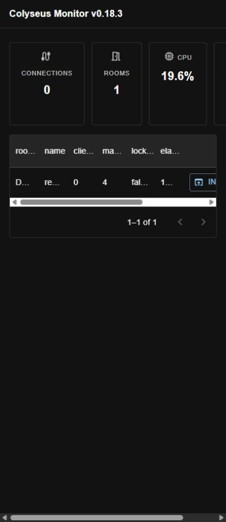
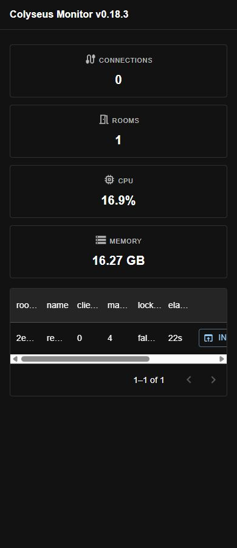
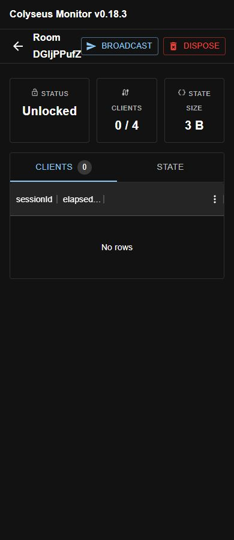
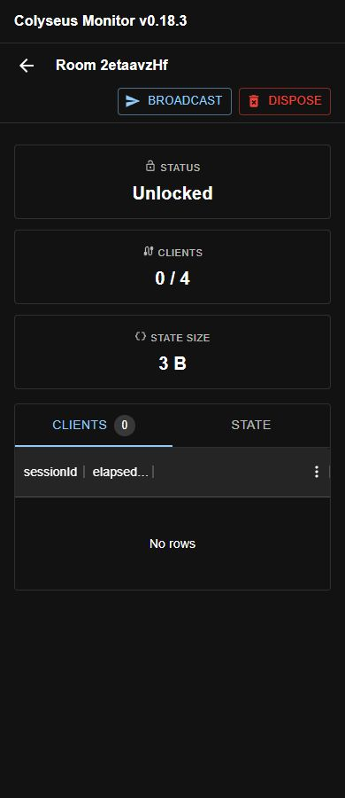

# Monitor small-screen layout evidence

Base: `2ee699b70262432a359103ec802f249f134253eb`.
Fix: `90dd0b9ca4c49068943353df3946c78b8cb1f529`.

Captured in a Chromium-based browser against a local Express monitor with real LocalDriver/LocalPresence and a schema room (`count: 1`, maxClients 4). No connected clients or production server. The original UI and rebuilt UI use the same local fixture; restarting it changes the generated room ID. Memory/CPU values vary between captures.

Before: list document width was 452px at 320px and 390px viewports in the recorded measurement; room detail reached 376px at 320px. The minimum width varies with CPU/memory text. The screenshots also show the cramped room title and wrapped card labels.

After: empty list, populated list and room detail all have document scrollWidth equal to viewport width at 320, 390, 599, 600 and 1280px. Stat-card positions at 600 and 1280px match the original layout. See `monitor-layout-measurements.json` for DOM measurements.

Manually verified Inspect navigation, the State tab showing the real schema value, Broadcast dialog opening/cancellation, and the room Back button. The data grid retains its own horizontal scrolling.

Validation: root `pnpm build` and monitor package build exit 0; their existing declaration diagnostics remain. Monitor `tsc --noEmit` reports exactly the same pre-existing diagnostics as the upstream baseline (not a clean type check). No dependencies or backend behavior changed.

| 390px | Before | After |
| --- | --- | --- |
| List |  |  |
| Room |  |  |

Screenshots and measurements are review artifacts on a separate fork branch, not part of the code PR.
